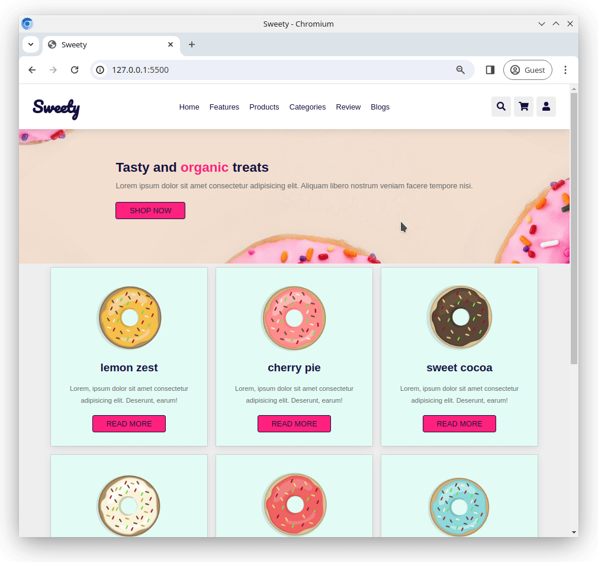

## Small study project with first steps for responsiveness

# The Sweety Bakery

A bakery has contracted you to build them a website for their tasty range of doughnuts 🍩.

## Task

Build a single page, responsive layout that showcases the doughnuts. Refer to the images below for a reference for the design. The page should be responsive.

- All images for the design can be found in the [/images/](/images/) folder
- The font used for the logo 'Sweety' is [Pacifico](https://fonts.google.com/specimen/Pacifico?query=pacifico) from [Google Fonts](https://fonts.google.com/)
- All other text is using the font 'Arial'
- Some CSS variables have already been defined for you in the [/css/style.css](/css/style.css) file

## Requirements

- Use semantic tags such as `<header>`, `<main>`, `<nav>` etc.
- The navigation bar should be fixed (it should not scroll with the page)
- Navigation links should be hidden on mobile
- Navigation links should show as the burger icon on mobile (it doesn't need to be functional)
- Menu links should have a deep pink underline on hover
- Icons should have a deep pink background on hover
- The website should be responsive and have separate layouts for **mobile**, **tablet** and **desktop**. The exact details of where you choose to set the breakpoints is up to you.
- Use [fontawesome](https://fontawesome.com/) for the icons

### Reference Images

- [For small devices (mobile)](/reference/mobile.png)

- [For medium sized devices (tablet)](/reference/tablet.png)

- [For large devices (desktop)](/reference/desktop.png)

- [Menu](/reference/menu.png)

- [Icons](/reference/icons.png)
